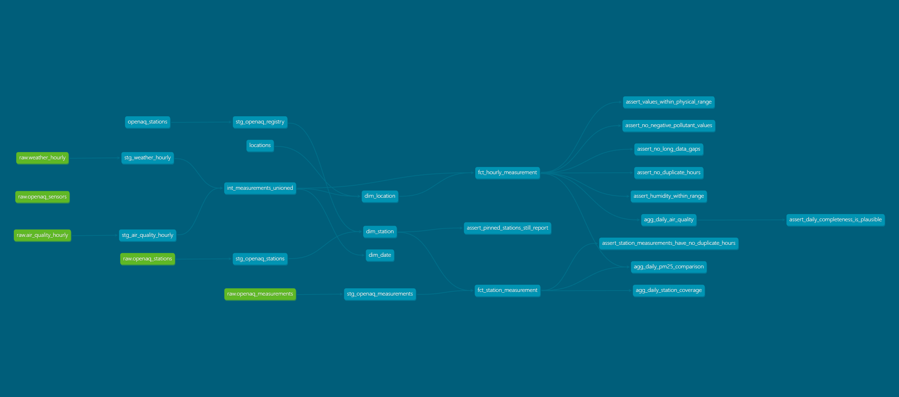

# Southeast Asia Air Quality Data Pipeline

An end-to-end ELT pipeline that ingests hourly weather and air quality data for six
Southeast Asian cities from public APIs, loads it into PostgreSQL, models it into a
star schema with dbt, and validates every layer with automated data quality tests.

Built to practise the data engineering fundamentals that matter in production:
idempotent loading, layered modelling, explicit data contracts, and tests that fail
loudly when the data stops making sense.

---

## Architecture

```
┌─────────────────┐
│  Open-Meteo     │  weather (archive)
│  Open-Meteo     │  air quality
└────────┬────────┘
         │  httpx + tenacity (retry with backoff)
         ▼
┌─────────────────┐
│  raw schema     │  stored verbatim, no transformation
│  PostgreSQL     │  composite PK -> idempotent re-runs
└────────┬────────┘
         │  dbt
         ▼
┌─────────────────┐
│  staging        │  rename, cast, tag domain
│  intermediate   │  union both domains, build surrogate key
│  marts          │  fct_hourly_measurement + dimensions
└────────┬────────┘
         │
         ▼
    analysis / BI
```



## Data sources

| Source | Data | Grain | API key |
|---|---|---|---|
| [Open-Meteo Archive](https://open-meteo.com/en/docs/historical-weather-api) | Temperature, humidity, precipitation, wind | Hourly | Not required |
| [Open-Meteo Air Quality](https://open-meteo.com/en/docs/air-quality-api) | PM2.5, PM10, CO, NO2, O3 | Hourly | Not required |

Cities covered: Jakarta, Singapore, Bangkok, Kuala Lumpur, Manila, Hanoi.

## Quick start

Requires Docker and Python 3.11+.

```bash
git clone https://github.com/TingCoding/seasia-air-quality-pipeline.git
cd seasia-air-quality-pipeline

cp .env.example .env                 # set a password
docker compose up -d                 # PostgreSQL + Adminer

python -m venv .venv && source .venv/bin/activate
pip install -r requirements.txt

python -m ingestion.run_ingest --start 2025-01-01 --end 2025-12-31

cd dbt
cp profiles.yml.example profiles.yml # set the same password
dbt build
```

Adminer is available at http://localhost:8081 (host `postgres`, database `air_quality`).

Run the Python test suite with `pytest` from the repository root.

## Project structure

```
ingestion/        API clients and idempotent loading into the raw layer
  clients/        one module per source system
dbt/
  models/
    staging/      cleaning and renaming, one model per source table
    intermediate/ unions both domains into a single stream
    marts/        fact table, dimensions, daily aggregate
  tests/          singular tests written as SQL
  seeds/          location reference data
sql/ddl/          raw schema, applied on first container start
tests/            pytest suite for the ingestion layer
docs/             data dictionary, lineage graph, decision log
```

## Data model

The marts layer follows a star schema.

| Model | Type | Grain |
|---|---|---|
| `fct_hourly_measurement` | fact | one row per location × hour × variable × source |
| `dim_location` | dimension | one row per city |
| `dim_date` | dimension | one row per calendar day |
| `agg_daily_air_quality` | aggregate | one row per city × day × pollutant |

Measurements are stored in **long format** — one row per variable rather than one
column per variable. Adding a new pollutant or weather variable therefore requires no
schema migration.

All timestamps are stored in UTC. Local time is derived in the fact table using the
timezone held in `dim_location`, so the raw layer stays neutral and no information is
lost at ingestion time.

## Data quality checks

The pipeline runs automated tests on every `dbt build`, across all three layers.

**Generic tests** — uniqueness of surrogate keys, not-null constraints on all key
columns, accepted values for variable names and domains, and referential integrity
between the fact table and both dimensions.

**Singular tests** — written as SQL in `dbt/tests/`:

| Test | Severity | What it catches |
|---|---|---|
| `assert_no_negative_pollutant_values` | error | Sensor calibration faults and parsing errors |
| `assert_humidity_within_range` | error | Values outside the physically possible 0–100% range |
| `assert_values_within_physical_range` | error | Unit errors and impossible readings across every variable |
| `assert_no_duplicate_hours` | error | Regressions in ingestion idempotency |
| `assert_no_long_data_gaps` | warn | Series that silently stop reporting for over 24 hours |
| `assert_daily_completeness_is_plausible` | warn | Days averaged from less than 75% of expected hours |

Failures that reflect the upstream source rather than a defect in this pipeline are
raised as warnings, so they stay visible without blocking a build.

**Results are persisted.** The `log_dbt_results` macro runs `on-run-end` and appends
every test outcome to `audit.data_quality_log`. Test results otherwise live only in the
terminal and vanish when the window closes; stored in a table, data quality becomes
something that can be queried over time — which check fails most often, whether a
problem is new or long-standing, and whether a fix actually held.

Missing values are deliberately **kept, not dropped**. A gap in the data is
information: `fct_hourly_measurement.is_missing` flags it, and
`agg_daily_air_quality.measurement_completeness_pct` reports how much of each daily
average is actually backed by observations. A daily mean computed from three hours of
data is not the same as one computed from twenty-four, and that difference should be
visible rather than hidden.

## Findings

The second source was added to answer one question: how closely does a reanalysis
model track instruments on the ground? Loading a year of both, for six cities, gives a
clearer answer than expected — and one caveat that matters more than the answer.

### The model exaggerates differences between cities

| City | Comparable days | Modelled PM2.5 | Measured PM2.5 | Ratio |
|---|---:|---:|---:|---:|
| Hanoi | 348 | 51.7 | 38.5 | 0.78 |
| Kuala Lumpur | 325 | 38.8 | 24.3 | 0.64 |
| Bangkok | 210 | 23.6 | 24.2 | 1.20 |
| Singapore | 325 | 17.9 | 19.7 | 1.17 |
| Manila | 208 | 15.7 | 18.4 | 1.27 |
| Jakarta | 11 | 45.8 | 19.0 | 0.42 |

Ordered by modelled value, the pattern is monotonic. Wherever the model reads high it
sits above the stations; wherever it reads low it sits below them. The modelled values
span 15.7 to 51.7 µg/m³ — a range of 36. The measured values span 18.4 to 38.5, a range
of 20.

The stations therefore describe six cities that resemble each other considerably more
than the model suggests. Whether that reflects smoothing in the reanalysis, where
monitoring stations happen to be sited, or both, this dataset cannot distinguish. What
it does establish is that the two sources disagree in a direction that is systematic
rather than random, which is the more useful thing to know.

### Jakarta cannot be compared, and the pipeline says so

Jakarta contributes 11 comparable days out of 365, from a single low-cost sensor with
25.7% reporting completeness. On 142 of its 143 active days that sensor missed hours.

The 0.42 ratio in the table above is not a finding about Jakarta's air. It is an
artefact of one sparse sensor, and it is reported alongside `station_count`,
`measured_hours` and `is_comparable` precisely so that it can be recognised as one. A
pipeline that returned 0.42 with no context would be worse than one that returned
nothing.

### Low-cost sensors reported more reliably than reference monitors

| City | Station class | Stations | Mean completeness | Days with gaps |
|---|---|---:|---:|---|
| Singapore | low_cost | 3 | 97.8% | 109 / 772 |
| Hanoi | reference | 4 | 94.7% | 270 / 1409 |
| Kuala Lumpur | low_cost | 3 | 94.3% | 187 / 753 |
| Manila | low_cost | 3 | 93.6% | 58 / 263 |
| Bangkok | reference | 5 | 88.3% | 858 / 1490 |
| Jakarta | low_cost | 1 | 25.7% | 142 / 143 |

This runs against the assumption built into `dim_station.station_class`. Government
reference monitors were expected to be the dependable ones; on uptime, Singapore's
community sensors beat every reference network, and Bangkok's reference stations missed
hours on more than half their days.

Uptime is not accuracy, and this says nothing about which instrument reads a truer
value. But the classification was introduced on the assumption that reference monitors
are more trustworthy overall, and at least on this measure that assumption does not
hold. The column is kept — the distinction is still real — but it should not be used as
a proxy for reliability without checking.

### A caveat about the ratio column

Bangkok shows a mean difference of +0.6 µg/m³ yet a mean ratio of 1.20. The two are not
inconsistent: `difference` and `measured_over_modelled` are both averaged across days,
and the mean of daily ratios is not the ratio of the means. Days when both values are
small produce large ratios and pull the average up.

The difference column is the safer summary. The ratio is useful for spotting direction,
not for quantifying magnitude.

### What this does not establish

- A single sensor is not a city. Cities represented by one or three sensors are
  characterised by wherever those happen to sit.
- Reference monitors and low-cost sensors are compared here as though equivalent. They
  are not, and no calibration adjustment has been applied.
- Only PM2.5 is compared. Gaseous pollutants arrive in inconsistent units across
  providers and are excluded until conversion is handled explicitly.

## Technical decisions

A few worth highlighting — the full log is in [docs/decisions.md](docs/decisions.md).

**Raw data is stored verbatim.** If transformation logic turns out to be wrong, the
warehouse can be rebuilt without re-calling the APIs. It also draws a clean boundary:
ingestion moves data, dbt reshapes it.

**Loading is idempotent by design.** The raw tables use a composite primary key of
`(location_key, observed_at, variable, source)` and writes use `ON CONFLICT DO UPDATE`.
Re-running any date range is safe, which matters because API calls do fail halfway.

**Dependency versions are pinned exactly.** A loose range once resolved to a dbt 2.0
pre-release that does not support PostgreSQL. A repository that works today should
still work next month without a single line of code changing.

## Limitations and next steps

Known limitations, stated honestly:

- Open-Meteo air quality data is model-based rather than measured at ground stations.
  Integrating OpenAQ station data is the natural next step, and would introduce a
  genuinely messier second source.
- Loading is full-refresh over a supplied date range, not incremental. This is fine at
  the current volume but would not scale to years of data across many cities.
- There is no orchestration yet; ingestion is triggered manually.
- `dim_date` is rebuilt from the observed data range rather than covering a fixed
  calendar span.

Planned:

- Schedule daily incremental loads via GitHub Actions
- Continuous integration running `pytest` and `dbt build` on every push
- Incremental materialisation for the fact table

## License

MIT
